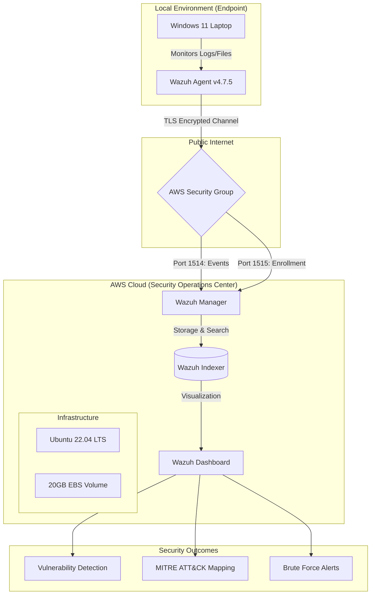

# Cloud-Native SIEM & Vulnerability Management Lab

## Overview

This project demonstrates the deployment of a cloud-native Security Information and Event Management (SIEM) environment using **Wazuh** hosted on **AWS EC2** to monitor a **Windows 11** endpoint in real time.

The lab simulates enterprise-level Security Operations Center (SOC) workflows including:

- Endpoint monitoring
- Vulnerability detection
- Threat analysis
- MITRE ATT&CK mapping
- Security configuration assessment
- Brute-force attack detection

---

# Architecture & Data Flow



---

# Infrastructure Components

## Manager (Cloud)

- Wazuh Manager
- Wazuh Indexer
- Wazuh Dashboard
- Hosted on Ubuntu 22.04 LTS
- AWS EC2 Instance Type: `t3.medium`

## Endpoint (Local)

- Windows 11 Laptop
- Wazuh Agent v4.7.5

---

# AWS Security Group Configuration

| Port | Protocol | Purpose | Source |
|------|----------|----------|---------|
| 22 | TCP | SSH Management | My IP Only |
| 443 | TCP | Wazuh Dashboard | 0.0.0.0/0 |
| 1514 | TCP | Agent Event Traffic | 0.0.0.0/0 |
| 1515 | TCP | Agent Registration | 0.0.0.0/0 |

---

# Project Screenshots

## AWS Security Group Rules


---

## Vulnerability Dashboard


---

## Critical Vulnerability Findings


---

## Active Wazuh Agent


---

## Security Configuration Assessment (SCA)


---

# Deployment Phases

## Phase 1 — Cloud Infrastructure Setup

- Created AWS EC2 Ubuntu instance
- Configured Security Groups
- Opened required SIEM ports
- Hardened SSH access

## Phase 2 — Wazuh Deployment

- Installed Wazuh Manager
- Installed Wazuh Indexer
- Installed Wazuh Dashboard
- Verified dashboard accessibility

## Phase 3 — Endpoint Integration

- Installed Wazuh Agent on Windows 11
- Registered endpoint with manager
- Verified secure telemetry flow

## Phase 4 — Vulnerability Assessment

- Performed baseline vulnerability scans
- Identified vulnerable software
- Verified CVE detection capabilities

## Phase 5 — Threat Monitoring

- Simulated brute-force login attempts
- Monitored alert generation
- Verified MITRE ATT&CK mappings

---

# Deployment Scripts

## Windows Agent Installation (PowerShell)

```powershell
# Deploy Wazuh Agent with Manager IP

Invoke-WebRequest -Uri https://packages.wazuh.com/4.x/windows/wazuh-agent-4.7.5-1.msi `
-OutFile ${env.tmp}\wazuh-agent.msi

msiexec.exe /i ${env.tmp}\wazuh-agent.msi /q `
WAZUH_MANAGER='YOUR_AWS_IP' `
WAZUH_REGISTRATION_SERVER='YOUR_AWS_IP'

NET START WazuhSvc
```

---

## Linux Filesystem Expansion

```bash
sudo growpart /dev/nvme0n1 1
sudo resize2fs /dev/nvme0n1p1
```

---

# Vulnerability Findings

## Baseline Assessment

Initial scans identified multiple security vulnerabilities on the Windows 11 endpoint.

| Severity | Count |
|----------|-------|
| Critical | 2 |
| High | 10 |
| Medium | 11 |
| Low | 1 |

### Key Findings

- Python 3.10.11 vulnerable to multiple CVEs
- MySQL Server 5.0 detected as End-of-Life software
- Weak security configuration settings identified through SCA scans

---

# Remediation Actions

The following remediation steps were performed:

- Removed unsupported MySQL Server 5.0
- Updated vulnerable Python packages
- Improved system hardening posture
- Reduced overall attack surface

---

# Threat Detection Results

## Brute Force Simulation

A brute-force attack simulation was conducted against the monitored endpoint.

### Detection Outcomes

- Wazuh generated high-severity alerts
- Events mapped successfully to:
  - **MITRE ATT&CK T1110 — Brute Force**
- Alert telemetry visible in real time within the dashboard

---

# Security Challenges & Troubleshooting

## Storage Constraints

- Expanded AWS EBS volume from 8GB to 20GB
- Prevented Wazuh indexing failures

## Firewall Hardening

- Fixed agent connectivity issues
- Restored HTTPS dashboard access
- Validated Security Group rules

## Resource Management

```bash
tail -f /var/ossec/logs/ossec.log
```

---

# Skills Demonstrated

## Cloud Security

- AWS EC2 deployment
- Security Group hardening
- EBS storage management

## SOC Operations

- Real-time monitoring
- Threat detection
- Alert analysis

## Vulnerability Management

- CVE detection
- Remediation lifecycle
- Risk reduction

## System Administration

- Ubuntu Linux administration
- PowerShell automation
- Windows endpoint management

---

# Technologies Used

- AWS EC2
- Ubuntu 22.04 LTS
- Wazuh SIEM
- Windows 11
- PowerShell
- Linux Bash
- MITRE ATT&CK Framework

---

# Future Improvements

- Integrate Suricata IDS
- Add Sigma detection rules
- Configure email alerting
- Implement log forwarding pipelines
- Add multi-endpoint monitoring

---

# Author

**DOOLAM DATTATREYA**  
MCA Cybersecurity & Forensics Student

---

# License

This project is licensed under the MIT License.