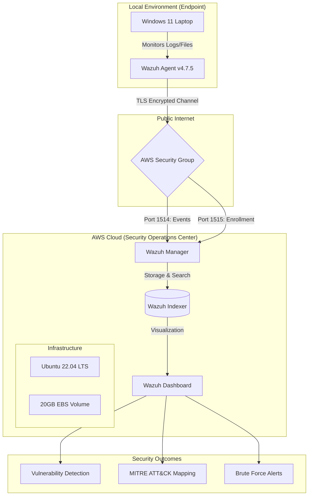

# Cloud-Native SIEM & Vulnerability Management Lab

A Wazuh SIEM deployment on AWS EC2, monitoring a Windows 11 endpoint —
built to get hands-on with what a SOC actually looks like day to day:
endpoint monitoring, vulnerability scanning, MITRE ATT&CK mapping, and
detecting a simulated brute-force attack.

## Architecture



## Setup

**Manager (cloud side)** — Wazuh Manager, Indexer, and Dashboard, all
running on a single `t3.medium` EC2 instance on Ubuntu 22.04.

**Endpoint (local side)** — my own Windows 11 laptop, running Wazuh
Agent v4.7.5.

### Security group rules

| Port | Protocol | Purpose | Source |
|------|----------|----------|---------|
| 22 | TCP | SSH management | My IP only |
| 443 | TCP | Wazuh dashboard | 0.0.0.0/0 |
| 1514 | TCP | Agent event traffic | 0.0.0.0/0 |
| 1515 | TCP | Agent registration | 0.0.0.0/0 |

I'd tighten 443/1514/1515 down from open access in a real deployment —
left them open here since this is a single-endpoint lab, not production.

## Screenshots


*Security group rules*


*Vulnerability dashboard*


*Critical findings*


*Agent connected and reporting*


*Security configuration assessment results*

## How I built it

1. **Infrastructure** — spun up an EC2 Ubuntu instance, configured the
   security group, hardened SSH access to my IP only
2. **Wazuh install** — Manager, Indexer, and Dashboard, then confirmed I
   could actually reach the dashboard
3. **Endpoint enrollment** — installed the agent on my Windows 11 machine
   and registered it with the manager, checked telemetry was flowing
4. **Vulnerability scanning** — ran baseline scans, checked what came back
   against known CVEs
5. **Threat simulation** — ran a brute-force login attempt against the
   endpoint and watched how Wazuh alerted on it and mapped it to MITRE ATT&CK

## Windows agent install (PowerShell)

```powershell
# Deploy Wazuh Agent with Manager IP

Invoke-WebRequest -Uri https://packages.wazuh.com/4.x/windows/wazuh-agent-4.7.5-1.msi `
-OutFile ${env.tmp}\wazuh-agent.msi

msiexec.exe /i ${env.tmp}\wazuh-agent.msi /q `
WAZUH_MANAGER='YOUR_AWS_IP' `
WAZUH_REGISTRATION_SERVER='YOUR_AWS_IP'

NET START WazuhSvc
```

## Expanding the EBS volume

Ran into indexing failures early on from running out of disk — this fixed it:

```bash
sudo growpart /dev/nvme0n1 1
sudo resize2fs /dev/nvme0n1p1
```

## What the vulnerability scan found

| Severity | Count |
|----------|-------|
| Critical | 2 |
| High | 10 |
| Medium | 11 |
| Low | 1 |

The two critical findings were a Python 3.10.11 install with several known
CVEs, and an old MySQL Server 5.0 instance that's been end-of-life for
years. SCA scans also flagged a handful of weak configuration settings.

**What I did about it:**
- Removed the MySQL 5.0 install entirely
- Updated the vulnerable Python packages
- Cleaned up a few of the flagged config settings to reduce the attack surface

## Brute-force detection

Ran a simulated brute-force login attempt against the endpoint to see if
the setup would actually catch it. Wazuh generated high-severity alerts
and correctly mapped the activity to **MITRE ATT&CK T1110 (Brute Force)**,
visible in the dashboard in near real time.

## Problems along the way

**Disk space.** The default 8GB EBS volume wasn't enough — Wazuh started
throwing indexing errors under load. Bumped it to 20GB and that resolved it.

**Agent connectivity.** Had some early issues getting the Windows agent to
actually reach the manager — turned out to be a security group rule I'd
misconfigured. Fixed the rule and also had to re-check dashboard HTTPS
access after that.

**Debugging in general.** Kept `/var/ossec/logs/ossec.log` open in a
separate terminal for most of this — that log is where most of the useful
error detail actually shows up:

```bash
tail -f /var/ossec/logs/ossec.log
```

## Stack

AWS EC2, Ubuntu 22.04 LTS, Wazuh SIEM, Windows 11, PowerShell, Bash,
MITRE ATT&CK framework.

## Where I'd take this next

- Add Suricata for network-level IDS alongside Wazuh
- Try writing some custom Sigma detection rules instead of relying only
  on Wazuh's built-in ones
- Set up actual email alerting instead of just watching the dashboard
- Expand to more than one endpoint — this lab only covers a single machine

## Author

Built by [Dattatreya](https://github.com/doolamdattatreya2025) — MCA Cybersecurity & Forensics student.

## License

MIT
