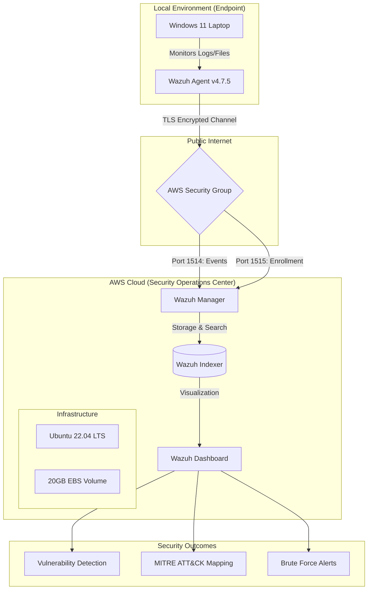
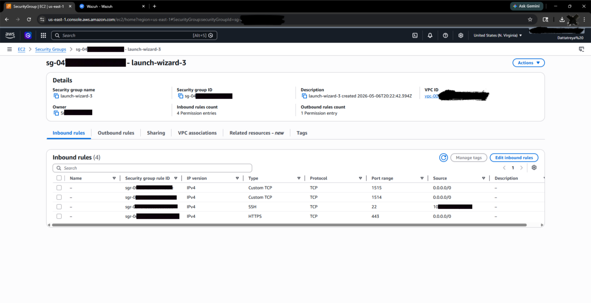
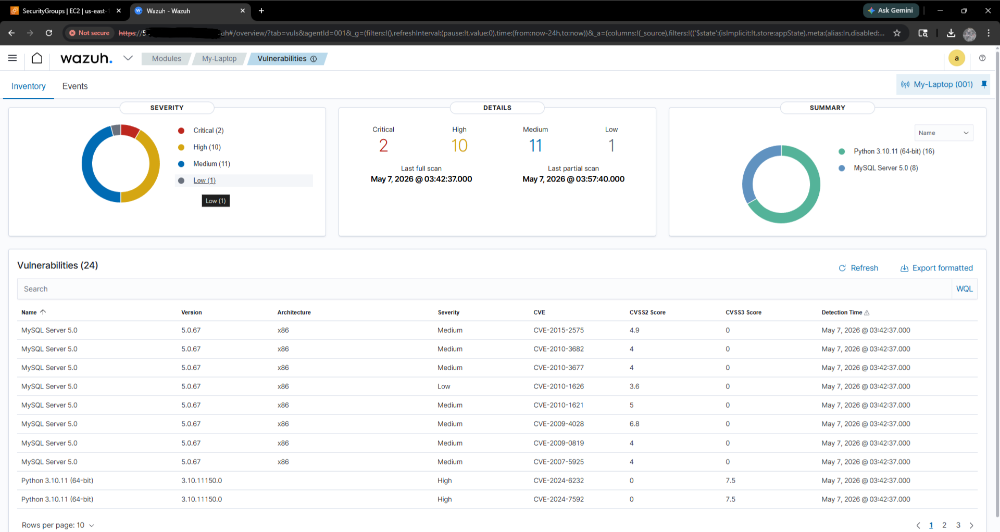
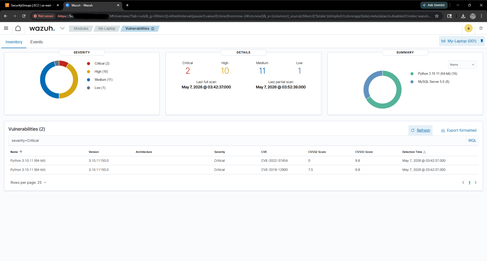
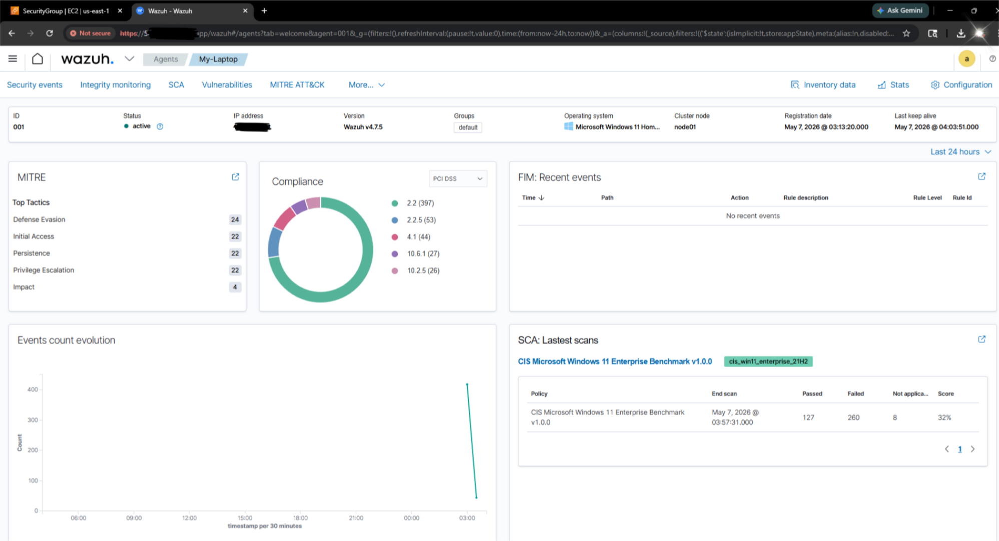

# Cloud-Native SIEM & Vulnerability Management Lab

A Wazuh SIEM setup on AWS EC2, watching over a Windows 11 computer. I
built this to learn how a real SOC (Security Operations Center) works —
watching a computer for problems, finding weak spots, matching attacks to
MITRE ATT&CK, and catching a fake brute-force attack.

## How it's set up



## Setup

**Manager (in the cloud)** — Wazuh Manager, Indexer, and Dashboard, all
running on one `t3.medium` EC2 server using Ubuntu 22.04.

**Endpoint (on my laptop)** — my own Windows 11 laptop, running Wazuh
Agent v4.7.5.

### Security group rules (firewall rules)

| Port | Type | What it's for | Who can access |
|------|----------|----------|---------|
| 22 | TCP | SSH login | Only my IP |
| 443 | TCP | Wazuh dashboard | Everyone |
| 1514 | TCP | Agent sends events | Everyone |
| 1515 | TCP | Agent sign-up | Everyone |

In a real company setup, I would lock down 443/1514/1515 too, not leave
them open to everyone. I left them open here since this lab only has one
computer connected.

## Screenshots


*Security group rules*


*Vulnerability dashboard*


*Critical findings*


*Agent connected and sending data*


*Security configuration check results*

## Steps I followed

1. **Set up the server** — created an EC2 Ubuntu server, set up the
   firewall rules, and locked SSH access to only my own IP
2. **Installed Wazuh** — Manager, Indexer, and Dashboard, then checked I
   could open the dashboard in a browser
3. **Connected the endpoint** — installed the agent on my Windows 11
   laptop, connected it to the manager, checked that data was flowing in
4. **Ran a vulnerability scan** — scanned the laptop and checked the
   results against known security bugs (CVEs)
5. **Tested an attack** — ran a fake brute-force login attempt on the
   laptop and watched how Wazuh caught it and matched it to MITRE ATT&CK

## Installing the agent on Windows (PowerShell)

```powershell
# Deploy Wazuh Agent with Manager IP

Invoke-WebRequest -Uri https://packages.wazuh.com/4.x/windows/wazuh-agent-4.7.5-1.msi `
-OutFile ${env.tmp}\wazuh-agent.msi

msiexec.exe /i ${env.tmp}\wazuh-agent.msi /q `
WAZUH_MANAGER='YOUR_AWS_IP' `
WAZUH_REGISTRATION_SERVER='YOUR_AWS_IP'

NET START WazuhSvc
```

## Making the disk bigger

The server started having problems saving data because it ran low on
space. This fixed it:

```bash
sudo growpart /dev/nvme0n1 1
sudo resize2fs /dev/nvme0n1p1
```

## What the scan found

| Level | How many |
|----------|-------|
| Critical | 2 |
| High | 10 |
| Medium | 11 |
| Low | 1 |

The two critical problems were: an old Python 3.10.11 install with known
bugs, and an old MySQL Server 5.0 that Microsoft/Oracle no longer supports
or fixes. The security check also found a few weak settings.

**What I did to fix it:**
- Removed the old MySQL 5.0 install completely
- Updated the Python packages that had known bugs
- Fixed a few weak settings to make the system safer

## Testing a brute-force attack

I ran a fake brute-force login attempt on the laptop to see if the setup
would catch it. Wazuh sent high-priority alerts and correctly matched the
attack to **MITRE ATT&CK T1110 (Brute Force)**. I could see the alert on
the dashboard almost right away.

## Problems I ran into

**Not enough disk space.** The default 8GB storage wasn't enough — Wazuh
started throwing errors when saving data. I increased it to 20GB and that
fixed it.

**Agent couldn't connect.** At first the Windows agent couldn't reach the
manager. It turned out I had set up a firewall rule wrong. After fixing
the rule, I also had to check that the dashboard still worked over HTTPS.

**Finding the actual error.** I kept this log file open in a separate
window most of the time — it shows the real error messages when something
goes wrong:

```bash
tail -f /var/ossec/logs/ossec.log
```

## Tools used

AWS EC2, Ubuntu 22.04 LTS, Wazuh SIEM, Windows 11, PowerShell, Bash,
MITRE ATT&CK framework.

## What I want to add next

- Add Suricata for extra network-level attack detection
- Try writing my own detection rules (Sigma rules) instead of only using
  Wazuh's built-in ones
- Set up email alerts instead of only checking the dashboard
- Connect more than one computer — right now this only watches one laptop

## Author

Built by [Dattatreya](https://github.com/doolamdattatreya2025) — MCA Cybersecurity & Forensics student.

## License

MIT
